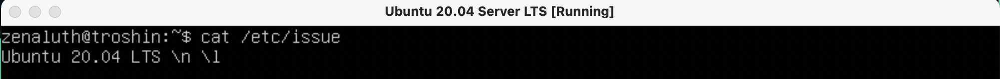

# D01_Linux Zenaluth

* Установка и обновления системы Linux. Основы администрирования.

 

## Part 1. Установка ОС

**== Задание ==**

- Установить **Ubuntu 20.04 Server LTS** без графического интерфейса.

 

**== Выполнение ==**

* Проводим устоновку образа **Ubuntu 20.04 srver LST** 
* Ставим образ на **VirtualBox**
* Результат выполненого запроса `cat /etc/issue` внутри получившейся виртуальной машины
 *Версия Ubuntu* 

 

## Part 2. Создание пользователя

**== Задание ==**

- Создать пользователя, отличного от пользователя, который создавался при установке. Пользователь должен быть добавлен в группу `adm`.

 

**== Выполнение ==**

* Выполняем команды `sudo adduser aga_user` и `sudo usermod -aG adm aga_user` для создания нового юзера и добавление его в группу `adm`

 *Результат выполнения команд* 

* Для проверки успеха выполнения задания выполняем `vim /etc/group`, что позволит посмотреть появился ли новый пользователь в группе `adm`

 *Содержимое файла group* 

 

## Part 3. Настройка сети OC

**== Задание ==**

- 1) Задать название машины вида user-1

- 2) Установить временную зону, соответствующую вашему текущему местоположению.

- 3) Вывести названия сетевых интерфейсов с помощью консольной команды. (Объяснить что такое lo)

- 4) Используя консольную команду получить ip адрес устройства, на котором вы работаете, от DHCP сервера. (Объяснить что такое dhcp)

- 5) Определить и вывести на экран внешний ip-адрес шлюза (ip) и внутренний IP-адрес шлюза, он же ip-адрес по умолчанию (gw).

- 6) Задать статичные (заданные вручную, а не полученные от DHCP сервера) настройки ip, gw, dns (использовать публичный DNS серверы, например 1.1.1.1 или 8.8.8.8).

- 7) Перезагрузить виртуальную машину. Убедиться, что статичные сетевые настройки (ip, gw, dns) соответствуют заданным в предыдущем пункте.

 

**== Выполнение ==**

 

### Exercise 1:

* Последовательно выполняем команды `sudo chmod 746 /etc/hostname` и  `sudo echo user-1 > /etc/hostname`

* Выполняя `cat /etc/hostname` проверяем результат

 *Результат смены имени машины* 

* Проводим перезапуск и проверяем результат ещё раз (Что бы убедиться что всё сохранилось нормально)

 *Результат повторной проверки* 

 

### Exercise 2:

* Выполняем команду `sudo timedatectl set-timezone Europe/Moscow`

* Проверяем результат выполнив `timedatectl`

 *Результат перевода системного времени* 

 

### Exercise 3:

* Выполняем команду `ls /sys/class/net` для отображения сетевых интерфейсов

 *Результат выполнения команды* 

* **lo это** - программный петлевой сетевой интерфейс. Это программный механизм замыкания на себя который можно использовать для повышения производительности, проведения анализа и тестирований программного обеспечения, и локальных коммуникаций.

 

### Exercise 4: 

* Выполняем команду `ip r`

 *Результат выполнения команды* 

* **DHCP это** - протокол динамической настройки узла, прикладной протокол, позволяющий сетевым устройствам автоматически получать IP-адрес и другие параметры, необходимые для работы в сети TCP/IP.

 

### Exercise 5:

* Последовательно выполняем команды для вывода внешнего ip шлюза, а потом внутренего `wget -qO- eth0.me` и `ip route | grep default`

 *Внешний ip-адрес шлюза (ip) и внутренний IP-адрес шлюза* 

 

### Exercise 6:

* Меняем доступ к файлу для дальнейшего его редактирования `sudo chmod 777 /etc/netplan/00-installer-config.yaml`

* Редактируем фаил под нужные настроики используя `vim /etc/netplan/00-installer-config.yaml` 

 *Итоговые параметры в файле* 

* Сохраняем изменения командой `sudo netplan apply` и перехапускаем машину

 

### Exercise 7:

* После перезапуска пингуем командой `hostname -I && ping -c 4 1.1.1.1 | grep "stat\|loss" && ping -c 4 ya.ru`

 *Вывод команды* 

 

## Part 4. Обновление ОС

**== Задание ==**

* Обновить системные пакеты до последней на момент выполнения задания версии.  

- После обновления системных пакетов, если ввести команду обновления повторно, должно появится сообщение, что обновления отсутствуют.
- Вставить скриншот с этим сообщением в отчёт.

 

**== Выполнение ==**

* Выполняем команду `sudo apt update` для получения доступных пакетов

  *Доступные к установке пакеты* 

 * Обновляем системные пакеты до последней версии командой `sudo apt full-upgrade`

 * Запускаем команду обнавления ещё раз (Проверяем получилось ли провести обновление)

  *Результат повторного обнавления* 

 

## Part 5. Использование команды **sudo**

**== Задание ==**

* Разрешить пользователю, созданному в Part 2, выполнять команду sudo.

- В отчёте объяснить *истинное* назначение команды sudo (про то, что это слово - "волшебное", писать не стоит).  
- Поменять hostname ОС от имени пользователя, созданного в пункте Part 2.
- Вставить скрин с изменённым hostname в отчёт.

 

 **== Выполнение ==**

 sudo это - команда которая позволяет строго определенным пользователям выполнять указанные программы с 
 административными привилегиями без ввода пароля суперпользователя root. Если быть точнее, то 
 команда sudo позволяет выполнять программы от имени любого пользователя, но, если идентификатор 
 или имя этого пользователя не указаны, то предполагается выполнение от имени суперпользователя root.

* Командой `sudo usermod -a -G sudo aga_user` разрешаем пользователю использовать sudo

* Командой `su - aga_user` меняем пользователя

* Изменение hostname под другим пользователем `sudo echo user-2 > /etc/hostname` 

* `cat /etc/hostname` смотрим результат

 *Результат выполнения команд* 

 

## Part 6. Установка и настройка службы времени

**== Задание ==**

* Настроить службу автоматической синхронизации времени.  

- Вывести время, часового пояса, в котором вы сейчас находитесь.
- Вывод следующей команды должен содержать `NTPSynchronized=yes`: \
  `timedatectl show`
- Вставить скрины с корректным временем и выводом команды в отчёт.

 

**== Выполнение ==**

* Проверяем время которое установлено в данный момент командой `date`

 *Установленое сейчас время* 

* Установка NTP командой `sudo apt install systemd-timesyncd`

* Активируем NTP командой `sudo timedatectl set-ntp on`

* Вывод команды `timedatectl show`

 *Результат работы команды* 

 

## Part 7. Установка и использование текстовых редакторов 

**== Задание ==**

* Установить текстовые редакторы **VIM** (+ любые два по желанию **NANO**, **MCEDIT**, **JOE** и т.д.)  

* 1) Используя каждый из трех выбранных редакторов, создайте файл *test_X.txt*, где X -- название редактора, в котором создан файл. Напишите в нём свой никнейм, закройте файл с сохранением изменений.  

  - В отчёт вставьте скриншоты:
    - Из каждого редактора с содержимым файла перед закрытием.
  - В отчёте укажите, что сделали для выхода с сохранением изменений.

* 2) Используя каждый из трех выбранных редакторов, откройте файл на редактирование, отредактируйте файл, заменив никнейм на строку "21 School 21", закройте файл без сохранения изменений.

  - В отчёт вставьте скриншоты:
    - Из каждого редактора с содержимым файла после редактирования.
  - В отчёте укажите, что сделали для выхода без сохранения изменений.

* 3) Используя каждый из трех выбранных редакторов, отредактируйте файл ещё раз (по аналогии с предыдущим пунктом), а затем освойте функции поиска по содержимому файла (слово) и замены слова на любое другое.

  - В отчёт вставьте скриншоты:
    - Из каждого редактора с результатами поиска слова.
    - Из каждого редактора с командами, введёнными для замены слова на другое.

 

**== Выполнение ==**

* Используя команду `sudo apt install mc` устанавливаем текстовый редактор MCEDIT

### Exercise 1:

* **VIM** 

* Создаем файл с помощью команды `vim test_vim.txt`

* Нажимаем на "i" в самом редакторе, для редактирования

* Пишу свой ник: "zenaluth"

Для выхода с сохранением нажимем `Esc` вводим команду `:wq` и нажимаем `Enter`

 *VIM* 

 

* **NANO**

* Создаем файл с помощью команды `nano test_nano.txt`

* Пишу свой ник: "zenaluth"

* Для выхода с сохранением нажимаем комбинацию `ctrl+x` вводим `Y` и нажимаем`Enter`

 *NANO* 

 

* **MCEDIT**

* Cоздаем файл с помощью команды `mcedit test_mcedit.txt`

* Пишу свой ник: "zenaluth"

* Для выхода с сохранением нажимаем `Esc` и подтверждаем выход с сохранением

 *MCEDIT* 

 

### Exercise 2:

* **VIM**

* Открываем файл с помощью команды `vim test_vim.txt`

* Нажимаем на "i" в самом редакторе, для редактирования

* Изменяем "zenaluth" на "21 School 21"

* Для выхода без сохранения нажимаем `Esc` вводим команду `:q!` и нажимаем `Enter`

 *VIM* 

* **NANO**

* Открываем файл с помощью команды `nano test_nano.txt`

* Изменяем "zenaluth" на "21 School 21"

* Для выхода без сохранения нажимаем комбинацию `ctrl+x` потом `N`

 *NANO* 

* **MCEDIT**

* Открываем файл с помощью команды `mcedit test_mcedit.txt`.

* Изменяем "zenaluth" на "21 School 21"

* Для выхода без сохранения нажимаем `Esc` и подтверждаем выход без сохранения

 *MCEDIT* 

 

### Exercise 3:

* **VIM**

* Открываем файл с помощью команды `vim test_vim.txt`

* Для поиска в VIM вводим `/zenaluth` и искомое слово выделяется в самом редакторе

 *VIM* 

* Для замены слова в VIM вводим `:%s/zenaluth/21 School 21` и слово "zenaluth" заменяется на "21 School 21"

 *VIM* 

 
* **NANO**

* Открываем файл с помощью команды `nano test_nano.txt`

* Для поиска в NANO вводим `ctrl + W`

 *NANO* 

* Для замены слова в NANO вводим `ctrl + \`, пишем "zenaluth", нажимаем `Enter`, пишем "21 School 21", нажимаем `Enter`, выбираем `Y`

 *NANO* 

 

* **MCEDIT**

* Открываем файл с помощью команды `mcedit test_mcedit.txt`

* Для поиска в MCEDIT вводим `F7`, вводим слово, которое хотим найти

* В всплывшем меню выбираем опцию OK или find all

 *MCEDIT* 

* Для замены слова в MCEDIT вводим `F4` пишем "zenaluth", нажимаем на клавишу "стрелка вниз", пишем "21 School 21", выбираем опцию OK а потом выбираем опцию Replace

 *MCEDIT* 

 

## Part 8. Установка и базовая настройка сервиса **SSHD**

**== Задание ==**

* 1) Установить службу SSHd.  

* 2) Добавить автостарт службы при загрузке системы.  

* 3) Перенастроить службу SSHd на порт 2022.  

* 4) Используя команду ps, показать наличие процесса sshd. Для этого к команде нужно подобрать ключи.
- В отчёте объяснить значение команды и каждого ключа в ней.

* 5) Перезагрузить систему.
- В отчёте опишите, что сделали для выполнения всех пяти пунктов (можно как текстом, так и скриншотами).
- Вывод команды netstat -tan должен содержать  \
`tcp 0 0 0.0.0.0:2022 0.0.0.0:* LISTEN`  \
(если команды netstat нет, то ее нужно установить)
- Скрин с выводом команды вставить в отчёт.
- В отчёте объяснить значение ключей -tan, значение каждого столбца вывода, значение 0.0.0.0.

 

**== Выполнение ==**

* Устанавливаем службу SSHd командой `sudo apt install openssh-server`

* Проверяем наличие командой `ssh -V`

 *Служба SSHd* 

* Добавляем автостарт службы SSHd командой `sudo update-rc.d ssh defaults`

* Изменяем порт SSHd командой `sudo vim /etc/ssh/sshd_config`

* Добавляем строку `Port 2022`

 *Изменёный кофик* 

* Используем команду `/etc/init.d/ssh restart` для того что бы изменения вступили в силу

 *Вывод команды* 

Используем команду `ps -axfv | grep sshd` для проверки наличия процесса

 *SSHd процесс* 

* Команда `ps` показывает текущие процессы на сервере. 

* Команда `grep` позволяет выдилить нужную нам информацию по процессам

* флаг -a оставляет все процессы, кроме лидеров сеансов и процессов, не связанных с терминалом

* флаг -x заставляет `ps` отображать список всех процессов, которыми вы владеете

* флаг -f выводит полноформатный список

* флаг -v выводит информацию о версии

 
* Устанавливаем *net-tools* `sudo apt install net-tools`

* Выполняем команду `netstat -tan`

 *Выполнение команды netstat -tan* 

* Опция -a показывает состояние всех сокетов

* -n показывает ip адрес, а не сетевое имя

* -t показывает только tcp соединения

* стобец Proto - протокол, используемый сокетом

* стобец Recv-Q - количество байтов, не скопированных пользовательской программой, подключенной к этому сокету

* стобец Local Adbress - локальный адрес (имя локального хоста) и номер порта сокета

* стобец Foreign Adbress - удаленный адрес (имя удаленного хоста) и номер порта сокета

* стобец State - состояние сокета

* Перезагружаем систему командой `sudo reboot`

 

## Part 9. Установка и использование утилит **top**, **htop**

**== Задание ==**

* Установить и запустить утилиты top и htop.  

- По выводу команды top определить и написать в отчёте:
  - uptime
  - количество авторизованных пользователей
  - общую загрузку системы
  - общее количество процессов
  - загрузку cpu
  - загрузку памяти
  - pid процесса занимающего больше всего памяти
  - pid процесса, занимающего больше всего процессорного времени

- В отчёт вставить скрин с выводом команды htop:
  - отсортированному по PID, PERCENT_CPU, PERCENT_MEM, TIME
  - отфильтрованному для процесса sshd
  - с процессом syslog, найденным, используя поиск 
  - с добавленным выводом hostname, clock и uptime

 

**== Выполнение ==**

* Командой `top` запускаем соответствующую утилиту

 *Запуск top* 

* uptime  

* количество авторизированных пользователей  

* общая загрузка системы  

* общее количество процессов  

* загрузка cpu  

* загрузка памяти  

* pid процесса, занимающего больше всего памяти  

* pid процесса, занимающего больше всего процессорного времени  

 

*  командой `htop` запускаем утилиту

 *Запуск htop* 

* Для выбора того как проводить сортировку мы нажимаем `F6`

* PID  

* PERCENT_CPU  

 
* PERCENT_MEM  

* TIME  

* Для работы с фильтром нажимаем `F4`

* После мы вводим `SShd` и нажимаем `Enter`

* фильтр по SSHd  

* Для работы с поиском нажимаем `F3`

* После мы вводим `syslog` и нажимаем `Enter`

* Результат поиска  

 

## Part 10. Использование утилиты **fdisk**

**== Задание ==**

* Запустить команду fdisk -l.
  - В отчёте написать название жесткого диска, его размер и количество секторов, а также размер swap.

 

**== Выполнение ==**

* Запуск утилиты командой `sudo fdisk -l`

 *Вывод команды* 

* Название жесткого диска VBOX HARDDISK   

* Размер  

* Количество секторов  

* Размер swap (пришлось использовать команду `free -h`)  

 

## Part 11. Использование утилиты **df** 

**== Задание ==**

* Запустить команду df.  
- В отчёте написать для корневого раздела (/):
  - размер раздела
  - размер занятого пространства
  - размер свободного пространства
  - процент использования
- Определить и написать в отчёт единицу измерения в выводе.  

* Запустить команду df -Th.
- В отчёте написать для корневого раздела (/):
    - размер раздела
    - размер занятого пространства
    - размер свободного пространства
    - процент использования
- Определить и написать в отчёт тип файловой системы для раздела.

 

**== Выполнение ==**

* используем команду `df /`  
 *Вывод команды* 
    
* Размер раздела  

* Размер занятого пространства  

* Размер свободного пространства  

* Процент использования  

* Единица измерения в выводе: Кб

 

* используем команду `df -Th /`  
 *Вывод команды* 

* Размер раздела  

* Размер занятого пространства  

* Размер свободного пространства  

* Процент использования  

* Тип файловой системы для раздела  

 

## Part 12. Использование утилиты **du**

**== Задание ==**

* Запустить команду du.

* Вывести размер папок /home, /var, /var/log (в байтах, в человекочитаемом виде)

* Вывести размер всего содержимого в /var/log (не общее, а каждого вложенного элемента, используя *)

- В отчёт вставить скрины с выводом всех использованных команд.

 

**== Выполнение ==**

* Запуcк команды `du`  
 *Вывод команды* 

* С помощью команды `sudo du -s -h /home && sudo du -s -h /var && sudo du -s -h /var/log` выводим размер папок  
 *Размер папок* 
    
* Вывести размер `/var/log` с помощью команды `sudo du -a -h /var/log`  
 *Размер* 

 

## Part 13. Установка и использование утилиты **ncdu**

**== Задание ==**

* Установить утилиту ncdu.

* Вывести размер папок /home, /var, /var/log.

- Размеры должны примерно совпадать с полученными в [Part 12](#part-12-использование-утилиты-du).

- В отчёт вставить скрины с выводом использованных команд.

 

**== Выполнение ==**

* Командой `sudo apt install ncdu` устанавливаем ncdu

* Вывести размер папок с помощью команды `ncdu`

 */home* 

 */var* 

 */var/log* 

 

## Part 14. Работа с системными журналами

**== Задание ==**

* Открыть для просмотра:
* 1. /var/log/dmesg
* 2. /var/log/syslog
* 3. /var/log/auth.log  

- Написать в отчёте время последней успешной авторизации, имя пользователя и метод входа в систему.
- Перезапустить службу SSHd.
- Вставить в отчёт скрин с сообщением о рестарте службы (искать в логах).

 

**== Выполнение ==**

* Просмотр /var/log/dmesg  

* Просмотр /var/log/syslog  

* Просмотр /var/log/auth.log  

    
* Для просмотра последней авторизации, имени пользователя и метода входа в систему используем команду `last`  
 *Результат работы команды* 

* Время авторизации Jul 27 15:30
* Имя пользователя zenaluth
* Метод входа в систему tty1

* Командой `sudo /etc/init.d/ssh restart` перезапускаем службу SSHd

 *Результат работы команды* 

* Командой `sudo cat /var/log/syslog` выводим сообщение о рестарте служб
 *Результат работы команды* 

 

## Part 15. Использование планировщика заданий **CRON**

**== Задание ==**

* Используя планировщик заданий, запустите команду uptime через каждые 2 минуты.
- Найти в системных журналах строчки (минимум две в заданном временном диапазоне) о выполнении.
- Вывести на экран список текущих заданий для CRON.
- Вставить в отчёт скрины со строчками о выполнении и списком текущих задач.

* Удалите все задания из планировщика заданий.
- В отчёт вставьте скрин со списком текущих заданий для CRON.

 

**== Выполнение ==**

* Используем команду `sudo apt install cron` для установки **CRON**

* Планируем задачу командой `crontab -e`

* В vim приписываем `"*/2 * * * * uptime"`

 *uptime* 

* Командой `crontab -l` выводим список установленых задач

 *Список текущих заданий* 

* Командой `sudo grep CRON /var/log/syslog` выводим системных задач

 *Системный журнал* 

* Командой `crontab -r` удаляем все запланированые задачи

* Проверяем список задач ещё раз

 *Системный журнал* 
